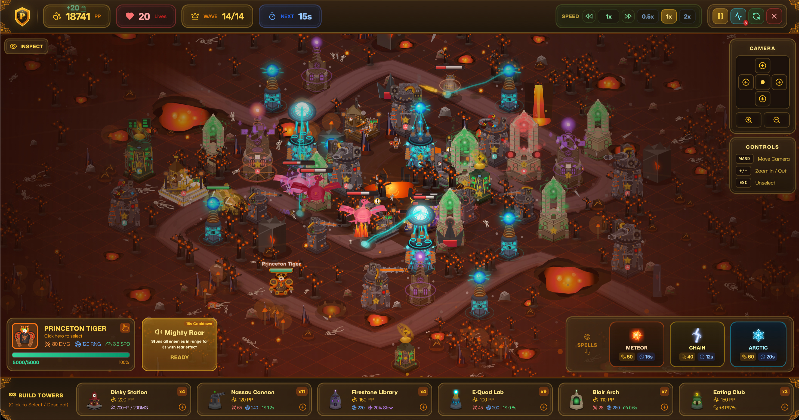

# Princeton Tower Defense

A fantasy tower defense game inspired by Princeton locations and Kingdom Rush.

Defend iconic Princeton-inspired battlefields with a full hero roster, branching tower upgrades, and chaotic dual-lane pressure. It is classic lane-defense strategy with an isometric style, custom map flavor, and way more personality than your average TD clone.

**[Play the game](http://princeton-tower-defense.vercel.app/)**



## Why It Hits

- **23 total levels** across campaign and challenge progression.
- **6 distinct towers** with upgrade paths tuned for damage, control, economy, and summons.
- **7 playable heroes** with different combat identities and active abilities.
- **Dual-path pressure maps** that force split-defense planning.
- **Hazards + special objectives** that change how each level is solved.
- **Star-based progression** with challenge unlock milestones.
- **Hand-crafted isometric visuals** with heavy canvas rendering polish.
- **Spell support + troop interactions** for comeback potential in bad waves.

## New Features

- Added **3 new challenge maps**: Cannon Crest, Triad Keep, and Frontier Outpost.
- Expanded the game to **23 playable maps** total (`15 campaign + 8 challenge`).
- Added **tower-restricted challenge rules** with in-game Locked states in the build menu.
- Added a **challenge-chain unlock flow** (`ivy_crossroads -> cannon_crest`, `blight_basin -> triad_keep`, `whiteout_pass -> frontier_outpost`).
- Added full **wave definitions** for the new challenge maps with dual-lane pressure patterns.
- Upgraded challenge objective logic with **multi-vault HP aggregation** and richer special-building interactions.
- Reworked world-map presentation with **region-specific challenge styling**, updated node metadata, and cleaner level descriptions.
- Added new **challenge map art direction** with themed mountain backdrops and stronger visual identity per region.
- Improved pre-wave readability with **hover-reactive spawn/wave bubble feedback**.
- Updated progression tracking so all new challenge maps slot cleanly into existing save progress.

## Core Gameplay

### Objective

Stop enemies from reaching the end of each path. Every escape costs a life. Hit zero lives and the run ends.

### Controls

| Action | Control |
| --- | --- |
| Place Tower | Click + drag from build menu |
| Select Tower/Hero | Click unit |
| Move Hero | Click destination while hero is selected |
| Cast Spell | Click spell icon in bottom bar |

### Strategy Notes

- Open with lane control and slow effects before pure DPS.
- Use Dinky troops and hero placement to stabilize split-lane spikes.
- Save spells for elite rushes or objective-defense emergencies.
- In restriction challenges, optimize around permitted tower synergies, not universal builds.

## Content Overview

### Towers (6)

| Tower | Role | Signature Upgrades |
| --- | --- | --- |
| **Nassau Cannon** | Heavy artillery | Gatling / Flamethrower |
| **Firestone Library** | Slow + control | EQ Smasher / Blizzard |
| **E-Quad Lab** | Chain magic DPS | Focused Beam / Chain Lightning |
| **Blair Arch** | Sonic AoE control | Shockwave Siren / Symphony |
| **Eating Club** | Economy support | Investment Bank / Recruitment Center |
| **Dinky Station** | Troop deployment | Centaur Archers / Heavy Cavalry |

### Heroes (7)

Tiger, Tenor, Mathey, Rocky, Scott, Captain, and Engineer each ship with distinct kits (tank, support, summon, ranged DPS, utility hybrids).

### Regions and Levels

- **Grassland**: Poe Field, Carnegie Lake, Nassau Hall, Ivy Crossroads, Cannon Crest
- **Swamp**: Murky Bog, Witch's Domain, Sunken Temple, Blight Basin, Triad Keep
- **Desert**: Desert Oasis, Pyramid Pass, Sphinx Gate, Sunscorch Labyrinth
- **Winter**: Glacier Path, Frost Fortress, Summit Peak, Whiteout Pass, Frontier Outpost
- **Volcanic**: Lava Fields, Caldera Basin, Obsidian Throne, Ashen Spiral

## Technical Details

### Runtime Architecture

- Main game loop is in `src/app/hooks/usePrincetonTowerDefenseRuntime.tsx` and runs simulation + render via `requestAnimationFrame`.
- Progression is data-driven with explicit unlock graphs:
  - `CAMPAIGN_LEVEL_UNLOCKS`
  - `REGION_CHALLENGE_UNLOCKS`
  - `CHALLENGE_LEVEL_UNLOCKS`
- Objective logic supports multiple special-building interactions (`vault`, `barracks`, `shrine`, `beacon`) and per-map objective HP behavior.

### Data-Driven Level Design

- `src/app/constants/maps.ts` defines:
  - path geometry (primary + optional secondary path)
  - map metadata (theme, camera, difficulty, level kind)
  - hazards and special structures
  - tower restrictions via `allowedTowers`
- `src/app/constants/waves.ts` defines per-level wave schedules and enemy composition.

### Challenge Terrain Pipeline

- `src/app/rendering/maps/challengeTerrain.ts` computes challenge path segments and mountain bounds.
- `src/app/rendering/maps/staticLayer.ts` builds region-specific challenge backdrops and isometric mountain terraces around path footprints.
- Decoration visibility for challenge levels is filtered by terrain footprint to keep scene composition coherent and performant.

### Rendering and Performance

- Static map, decoration, and ambient layers are cached to reduce per-frame draw cost.
- Quality-aware rendering adjusts fog complexity and other visual load based on runtime pressure.
- Additional optimization notes live in `docs/CANVAS_OPTIMIZATION.md`.

### Persistence Model

- `src/app/useLocalStorage.ts` now type-guards and merges game progress structures to avoid destructive schema drift.
- New maps can be introduced without invalidating older local saves.

## Local Development

```bash
npm install
npm run dev
```

Then open [http://localhost:3000](http://localhost:3000).

## Deploy on Vercel

The easiest deployment path is the [Vercel platform](https://vercel.com/new).
